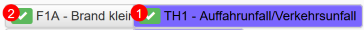
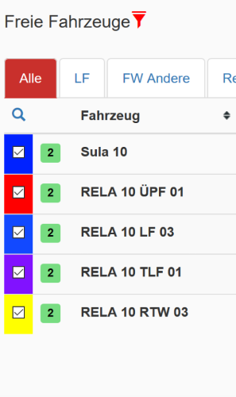

# LSS UserScript

[/statusIcon.svg)](https://team.leber-lfbg.ch/project.html?projectId=LssUserscript&tab=projectOverview)

Dieses Userscript für https://leitstellenspiel.de entstand als Übungsprojekt
für [Kotlin2JS](https://kotlinlang.org/docs/tutorials/javascript/kotlin-to-javascript/kotlin-to-javascript.html).
Es soll aber natürlich auch das Spielen erleichtern.

### Installation

* [Tampermonkey](https://tampermonkey.net/) als Addon im Browser aktiviert
* Klicke auf [diesen Link](https://github.com/Grisu118/lss-userscript/raw/master/script.user.js) und bestätige die Installation
* Habe Spass :)

### Features

* Gebäudeliste
  * Filtern
* Fahrzeugliste
  * Filtern
  * Verstecken der Verfügbaren Fahrzeuge (zeige nur Gesamtzahl)
  * Zusammenfassen von Löschfahrzeugen, Rüstwagen und Schlauchwagen
* AAO Klick Zähler
  * 
* Filtern der Fahrzeugliste im Einsatzfenster
  * Zeige Fahrzeuge welche alarmiert werden
  
  * Status des Filters wird gespeichert

### Haftungsausschluss

Die Nutzung des Scripts geschieht auf eigene Gefahr. Ich hafte nicht für
eventuell auftretende Schäden oder Ähnliches, die durch die Nutzung dieses
Scripts entstanden sind. Die SHPlay GmbH ist in keinster Weise für den
Inhalt des Scripts verantwortlich. Das Script ist losgelöst von SHPlay
und Leitstellenspiel.de