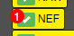

# LSS UserScripts

### Installation

* UserScript Browser Addon deiner Wahl installiert
* AAO Counter
  * https://greasyfork.org/de/scripts/510948-aao-counter
* AAO Marker
  * https://greasyfork.org/de/scripts/511080-aao-marker
* Mission Vehicle Filter
  * https://greasyfork.org/de/scripts/510949-mission-vehicle-filter
* Enhanced S5
  * https://greasyfork.org/de/scripts/510950-enhanced-s5

### Features

* AAO Klick Zähler
  * 
* Filtern der Fahrzeugliste im Einsatzfenster
  * Zeige Fahrzeuge welche alarmiert werden
  
  * Status des Filters wird gespeichert

### Haftungsausschluss

Die Nutzung des Scripts geschieht auf eigene Gefahr. Ich hafte nicht für
eventuell auftretende Schäden oder Ähnliches, die durch die Nutzung dieses
Scripts entstanden sind. Die SHPlay GmbH ist in keinster Weise für den
Inhalt des Scripts verantwortlich. Das Script ist losgelöst von SHPlay
und Leitstellenspiel.de